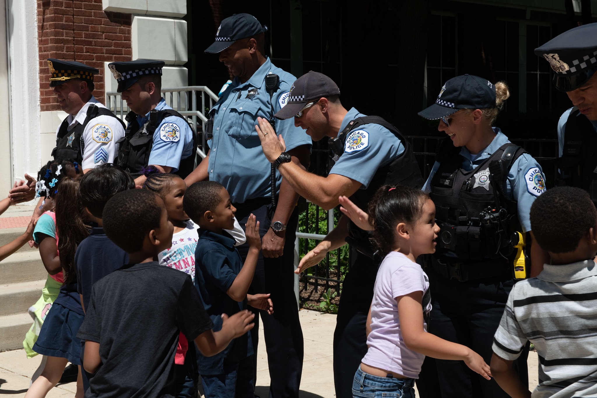
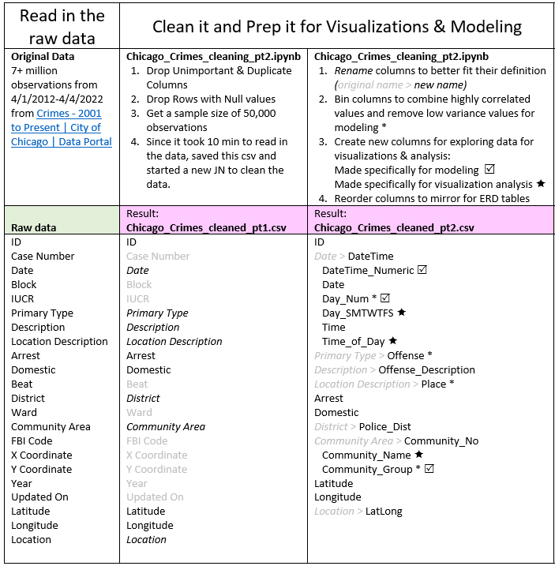
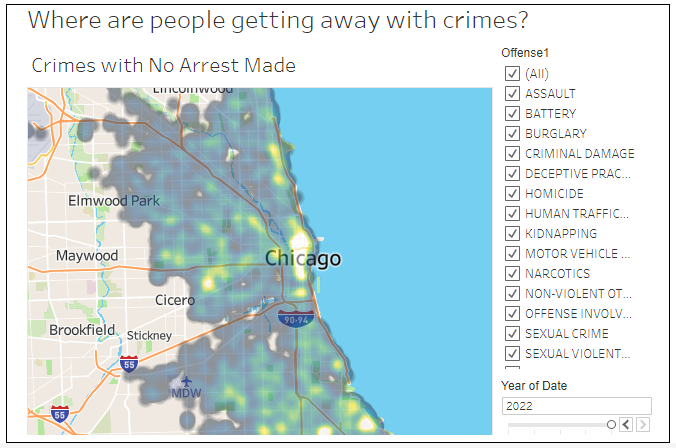
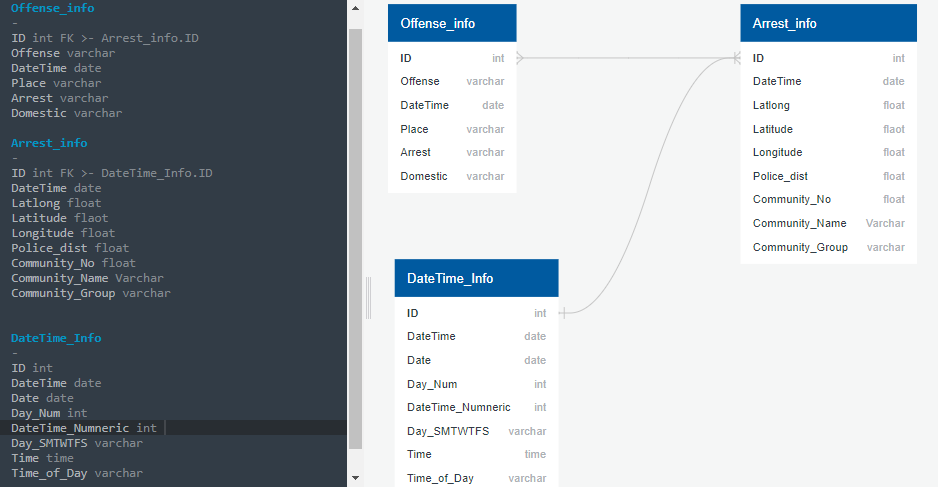
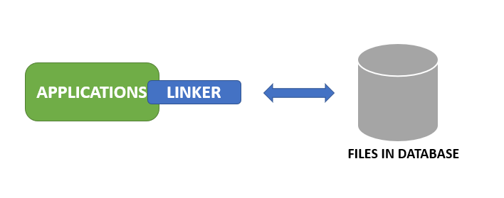
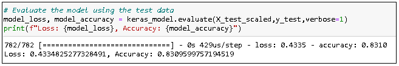
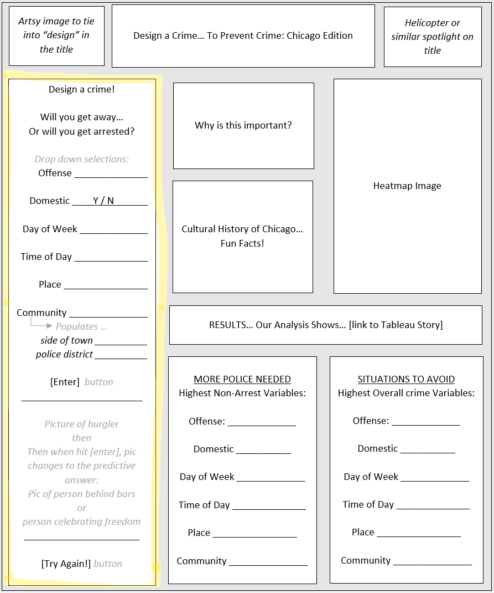

# Design A Crime ...to Prevent Crime: Chicago Edition

[Presentation](https://docs.google.com/presentation/d/14u6CbpL4J0axH1T8g-0-7e3nL5m1OLGN5Jqz6oYJY6k/edit#slide=id.p) | [Tableau Story](https://public.tableau.com/app/profile/courtney.hollis3563/viz/Chicago_Crimes_Jan2019-Apr2022/Story1?publish=yes)

## Project Overview 
Use Chicago crime data to Help The Chicago Police Department strategically allocate their resources to make Chicago safer.

### Reason Why we Selected Topic
With **crime** on the **rise** in Chicago we could potentially provide valuable information for **resource allocation**.

### Source of Data
- Data is reported incidents of crime from the Chicago Police Department's CLEAR (Citizen Law Enforcement Analysis and Reporting) system. (http://data.cityofchicago.org)
- Over 7 million observations ranging from 2001 to present.
- 21 Variables which will provide lots of information for trends.

### Questions we hope to answer with the data  
- What conditions are ideal to get away with a crime?
- What are the safest/unsafe areas of Chicago?
- Are Certain Times of The Year Safer than Others?
- Overall is it a safe place to relocate.
- What Types of Locations are Safe/Unsafe (Street, Apartment, alley, residence, parking lot, etc.)
- We will use predictive analysis to solve crime by patrolling certain areas.

**Null Hypothesis:** Based on provided information regarding a specific crime, we are not able to predict whether or not an arrest was made.

**Alternative Hypothesis:** Based on provided information regarding a specific crime, we will be able to predict whether or not an arrest was made.

## Resources
- **Data Source**: [Chicago_Crime](https://data.cityofchicago.org/Public-Safety/Crimes-2001-to-Present/ijzp-q8t2/data) 
- **Software**: Jupyter Notebook, Tableau 2022.1, Google Slides, Git Bash, Slack, Folium
- **Languages**: Python 3.7, Java Script
- **Libraries**: Scikit-learn, Pandas, Matplotlib, Sqlite3, SqlAlchemy, TensorFlow, Numpy, DateTime, Requests, Datetime, Tensorflows,CSV
- **Machine Learning Models**: Deep Neural Network, 
- **Database**: SQLite

## Communication Protocols
- Team all-included in Group Chat on Slack. 
- Team Created an Assignment Tracker with Google Sheets.
- Meeting Times Established Nightly 6-9pm and weekends 9am-3pm.
- [Assignment Tracker](https://docs.google.com/spreadsheets/d/1KjO2ZRQtjC6QZMFz5Bq4Tr4_8M9ysk9KLp6MI9d3TSA/edit?usp=sharing)

## Project Description 

### Data Cleaning and Exploration
Our Initial Step is to Download and Clean the Data for exploration and analysis.

**[Chicago Crimes Cleaning Pt.1 - Jupyter Notebook](Chicago_Crimes_cleaning_pt1.ipynb)**
  - Our Data was Read in from [Chicago_Crime](https://data.cityofchicago.org/Public-Safety/Crimes-2001-to-Present/ijzp-q8t2/data).
  - We Trimmed the Data down to starting in Jan 2018 through present (April 2022 at time of project) instead of the last 20 years. Why?
    - Since we are trying to predict how to help prevent crime in the future
    - Because COVID changed lives so much, we only keep the most recent including 1-year pre-COVID. 
    - and to reduce size f the data (from 7 million observations to 1 million observations.
 - Next we Removed Redundant and less useful Columns such as "Case Number" and FBI Code" 
 - Pandas was Used to Loop through the columns and find Null Values, Which We Removed
 - Took a sample of 50,000 observations (out of the 723,136 remaining) to move forward with. 
 - Exported to a csv [Chicago Crimes Cleaned Pt.1 - CSV](Resources/Chicago_Crimes_cleaned_pt1.csv)
 
 #
 
**[Chicago Crimes Cleaning Pt.2 - Jupyter Notebook](Chicago_Crimes_cleaning_pt2.ipynb)**

- Read in the dataset from part 1
- Added columns that would be useful in analysis, such as Community Name (read in from separate Chicago database) and Day of Week form Datetime values.
- Binned columns to have [a goal of] less than 10 values for better use in predictive modeling.
- Finally, We Exported the Remaining Data to a CSV to input into our SQLite Database
- exported to a csv [Chicago Crimes Cleaned Pt.2 - CSV](Resources/Chicago_Crimes_cleaned_pt2.csv)

<i> Cleaning_the_Data </i>

## Data Analysis 
We used Tableau to create visualizations to analyses the data. 
1. To analyze the different community and district areas, we had to add geo-map layers by linking two additional geojson datasets:
 - [Chicago_Crimes_Community_geo.geojson](Resources/Chicago_Crimes_Community_geo.geojson) | [Community_Geojson - Jupyter Notebook](Community_Geojson.ipynb)
 - [Chicago_Crimes_PD_geo.geojson](Resources/Chicago_Crimes_PD_geo.geojson) | [Police_Dist_Geojson - Jupyter Notebook](Police_Dist_Geojson.ipynb)
2. Here is our [Tableau Story](https://public.tableau.com/app/profile/courtney.hollis3563/viz/Chicago_Crimes_Jan2019-Apr2022/Story1?publish=yes)

<i> Data_Analysis </i>

##  Database 

**Entity Relationship Diagram**

<i> ERD </i>

**Why SQlite**

- Direct linking to DB
- No passwords / “Serverless”
- Open Source
- Fast and reliable
- Cross-platform Relational DB management system

**SQLite server-less architecture:**  

<i> Sqlite </i>

#### Approch

- At first, we import csv module (to work with csv file) and sqlite3 module (to populate the database table).
- Then we connect to our **myDatabase.db** database using the **sqlite3.connect()** method.
- At this point, we create a **cursor object** to handle queries on the database table.
- We first create our **Offense2** table and create a csv file with the contents inside which we will be inserting into our table.
- We open the above-created csv file using the **with open()** function.
- The With statement in Python is used in exception handling to make the code cleaner and much more readable. 
- It simplifies the management of common resources like file streams. 
- The with the statement itself ensures proper acquisition and release of resources.
- We extract all the contents of the csv file into our contents variable through **csv.reader()** method.
- Then we insert our row-wise contents of csv file into our database through **executemany()** method which will replace **(?,?)** with the next **two comma-separated data** of the csv file and insert it as a record into the **Offense2** table.
- Finally, we verify that the data of the csv file has been successfully inserted into our table with the **SELECT statement** and **commit** the changes and **close** the database connection.

[Chicago_Crimes_Cleaned_csv_to_DB.ipynb - Jupyter Notebook](Chicago_Crimes_Cleaned_csv_to_DB.ipynb)

## Machine Learning Model 

### PRELIMINARY DATA PROCESSING

[Machine Learning Model - Jupyter Notebook](Machine_Learning_Model.ipynb)

Cleaning the data to run the Model:

<i> Neural_Network_Model_on_'Arrest </i>

- First, we renamed necessary columns to remove spaces for machine learning processing.
- Next we dropped more redundant location categories
- We Ran a density visualization to Aid Decision-making for less important rows, which we then place into other category to keep data integrity
- Used Pandas to Convert Date to Appropriate Data Type
- Used OneHotEncoder to Modify Offense Categories. Doing This Splits our data categories into individual columns to be processed by machine learning model.
- We then Used Pandas to run Binary Encoding on our Boolean columns "Arrest" and "Domestic"

#

### DEFINING MODEL

We Defined our Features and Target and split the data

**Target**: Was an arrest made for committing a specific crime under provided conditions -YES

**Feature**: Were you arrested for committing a specific crime under provided conditions -NO;
Were you arrested for committing a specific crime under provided conditions -YES
Will you be arrested for committing specific crime under provided conditions - Yes

- Next we split our processed features and targets into a training and testing dataset using the train_test_split function 
- We Initialized a StandardScaler Instance, Fit the Standard Scaler and Then Scaled Data to format the data for our analysis
- We Then Established a Deep Neural Network With 2 Hidden Layers and an Output Layer
- We Ran Accuracy Scores on Keras Sequential Model and Random Forest Model and Our Sequential Model Performed better.

**Why Deep Neural Network?**

- We Chose a **Sequential Neural Network Model** Because its ideal for working with nonlinear data in a large dataset. 
- With our Data being so large it will give us a high level of performance.
- We Wanted to Take Advantage of DNN's ability to run **predictive analytics** to make predictions about potential arrests.
- Some set backs of Using the DNN Model is that a lot of the analyzing is done behind the scenes of the computer so it’s difficult to extract why or how your computer reached the end result. 
- Also, there is no specific rule for a DNN structure so trial and error is necessary to attempt to optimize the Model

#

### Analysis

- Our model’s accuracy score is 83.09,
- Which indicates our model is accurately predicting if a crime will result in an arrest 83.09% of the time based on the offense, the time and location it occurred. 
- Since we are using the model to paint a picture of where the most crimes are resulting without an arrest this score would be sufficient.

  

<i> Accuracy </i>

## Future Perspective

- Build a webpage to add all of the important elements, including  “Will you get arrested?” game. 
- Could make a universal project that could be used on different cities.
- Add MORE DATA!!! For example, pull in demographics of people that got arrested to understand and predict more trends.
  - Age
  - House Hold income
  - Race
- Police District funding 
  - less funding → less arrests → higher crime
- Community outlets 
  - After-school activities
  - Youth & adult sports programs
- Police Dept Community Engagement 
   - → To build rapport & trust

<i> Future_Web_Application </i>

